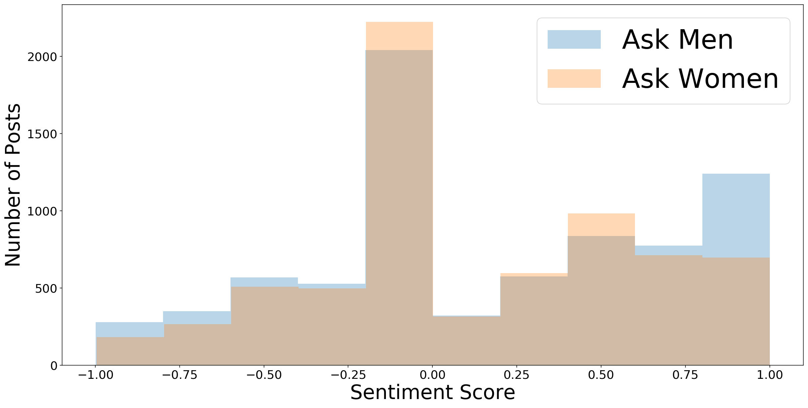

### **The Problem:**

A Data Company is hosting their monthly event *Talk Data to Me* which explores popular topics and the similarities and nuances of different social demographics. The event is highly curated for individuals who have high social compassion, responsibility and respect for groups other than their own. Talk Data to Me hosts H.R., marketing, and product development managers as well as entrepreneurs and non-profit leaders. Attendees are free to use insights at their discretion.

### **Getting the Insights:** 

For this month’s event, A Data Company is analyzing discussion boards on Reddit. These discussion boards provide unique benefits such as: 
- Unfiltered Conversation 
- Unbiased and Unprompted Data (most relevant to the population)
- Current Data
- Tons of Data
- Quick
- Cheap 

In this project I have been asked by Data for Good to delve into AskMen and AskWomen, both popular subreddits, to answer the following: 

##### Which gender is asking in AskMen and in AskWomen? 

###### What are the most common topics users are asking? 

###### What are the similarities between AskMen and AskWomen? 

###### What are the differences? 

##### Are conversations more positive or negative? 

### **The Data:**

Links to Jupyter Notebooks: 

[Scraping](./1_scraping_Reddit_project_3.ipynb)

[Cleaning and EDA](./2_Cleaning_Eda_Reddit_Project_3.ipynb)

[Modeling](./3_Modeling_Reddit_Project_3.ipynb)

10,000 of the most recent posts from both threads were collected through Pushshift’s API and converted to a DataFrame in Jupyter Notebook. Though the original data had dozens of features, only four were selected for analysis and cleaning: `created_utc` - the date the post was created, `title` - the title of the post, `selftext` the post content, and `subreddit` - the subreddit the content came from. The `title` and `selftext` features were then combined into one `all_text` feature. `all_text` was subsequently cleaned for analysis by removing formatting and punctuation, leaving only words and letter characters (acronyms, typos etc). 

##### **Who’s Asking:**

In general, men are asking in AskMen and women are asking in AskWomen, though occasionally a woman or non-binary person will pose a question in AskMen and vice versa. This information was gathered through examining samples of the syntax in posts. For example, questions that were posed as “Hey fellas... “ or “Hey ladies…” reflect syntax used when one felt a part of the group. On the other hand, “What do men think about…” or, “As a woman, what do you think about…,” indicates that the user did not identify with the group. Though rarely observed, users sometimes self-identified their gender status in their posts. 

#### **In general, users asked about relationships, sex, friends, dating, and hair.** 

##### **The Most Common Words Observed in AskMen:**

Friends, Sex, Relationship, Hair School, Girlfriend, Ex, Attractive, Weird, Love, Date, Partner, Weird, Shit, Porn, Dick, Family, Single, Body, College, Married 

##### **The Most Common Words Observed in AskWomen:**

Sex, Relationship, Friend, Men, Love, Ladies, Life, Advice, Work, Date, Period, Hair, Year, Girlfriend, Boyfriend, Pretty, Attractive, Body, Home, Month, Birth Control

##### **Words that Indicated the Post was Most Likely in AskMen** (Common words found in AskMen yet rarely found in AskWomen):

Research, urges, cologne, shit, compliments, dudes, guys, balls, men, fellas

##### **Words that Indicated the Post was Most Likely in AskWomen** (Common words found in AskWomen yet rarely found in AskMen):

Ladies, iud, pill, period, bi, women, bras, wedding, fetish, holiday

##### **Sentiment Analysis**

(on a scale from -1 to +1, -1 being negative, 0: neutral, and +1: positive) Sentiment was gauged by the Natural Language Tookit’s (NLTK) built-in sentiment analysis tool which ranked each word as positive, negative or neutral and aggregated a score for the overall text. 

Overall: 0.16

Men: 0.18

Women: 0.15

### Modeling:

##### How Similar are the Subreddits?**

Machine learning algorithms were used to predict if a post came from the `AskMen` or `AskWomen` subreddit. The original model, using Logistic Regression, was able to accurately predict which subreddit the post came from 67% of the time. To improve the prediction, multiple models including Decision Trees and K-Nearest Neighbors (KNN) were built using a grid search algorithm. Ultimately, a Random Forest model provided the greatest improvement, with a subreddit prediction accuracy of 70%. 